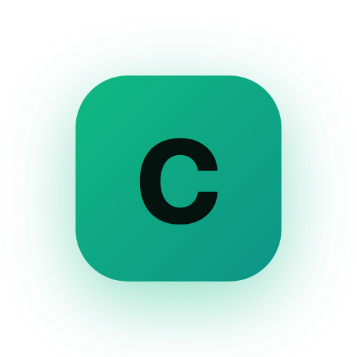
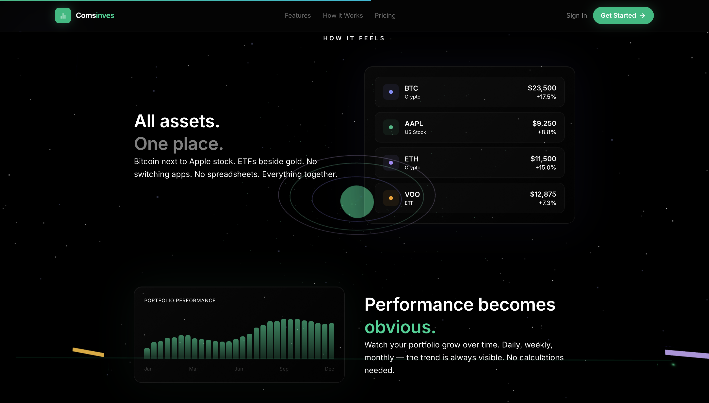
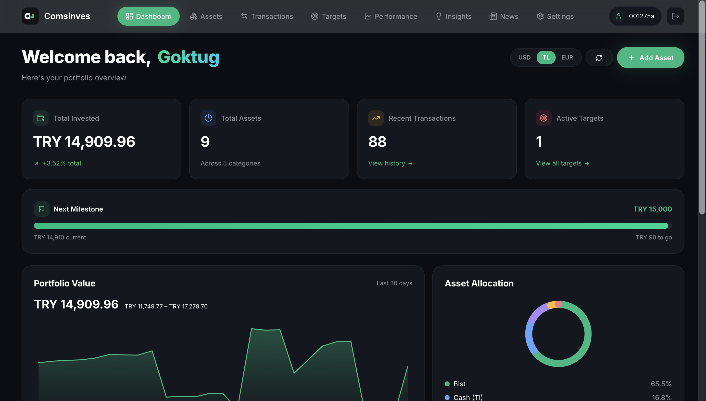
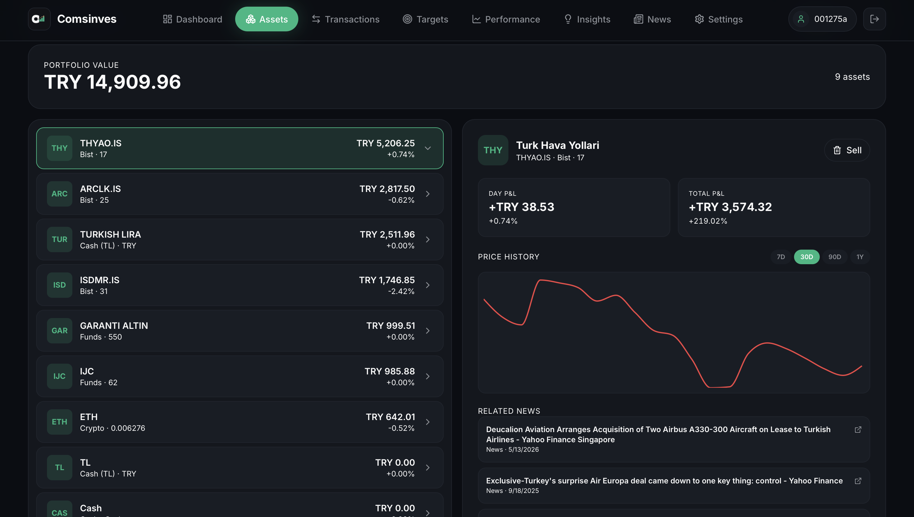
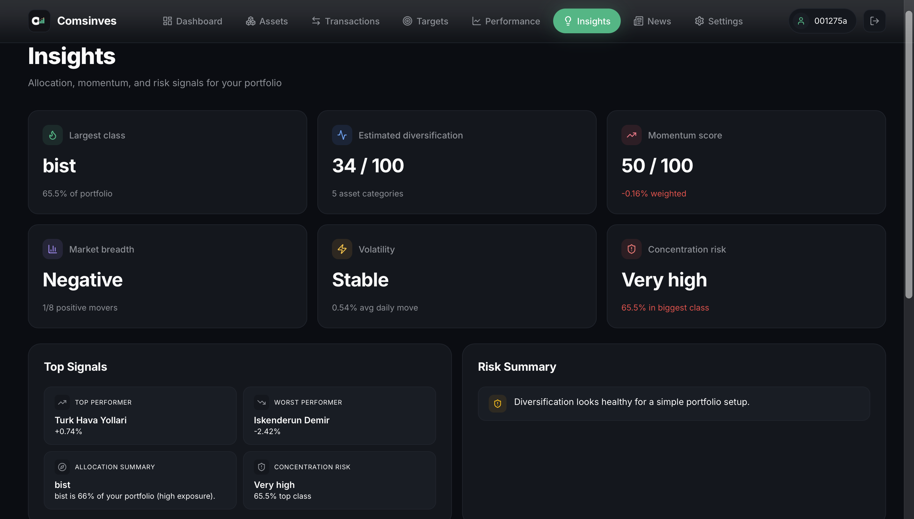
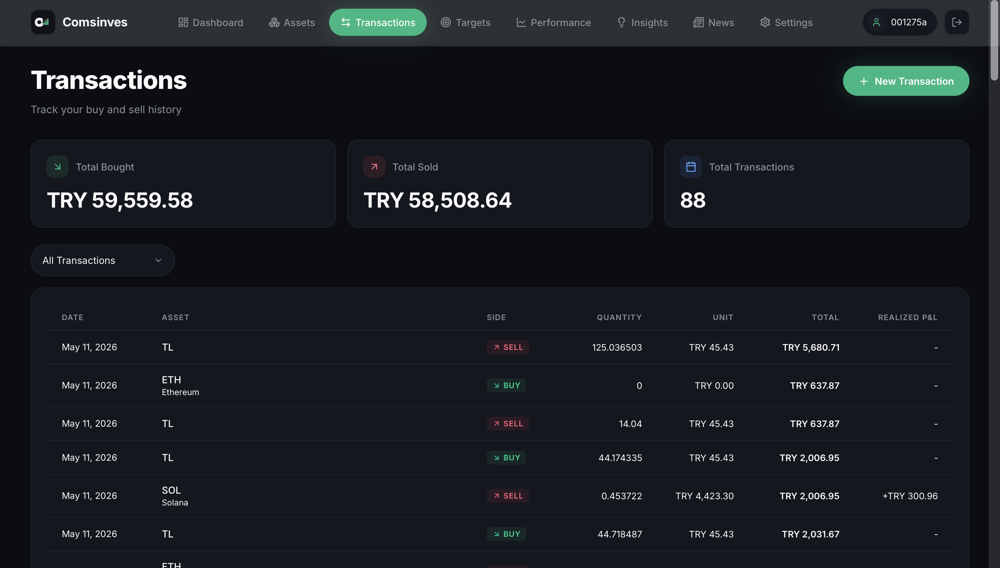
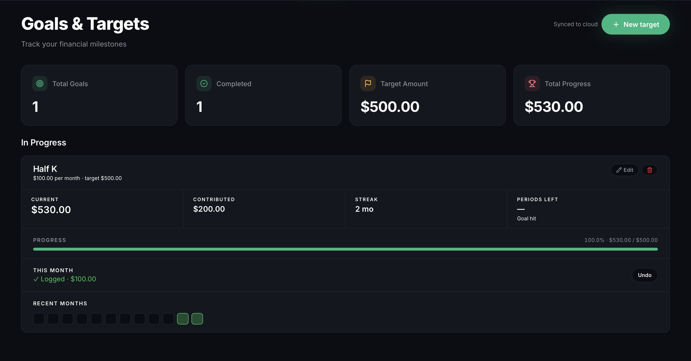
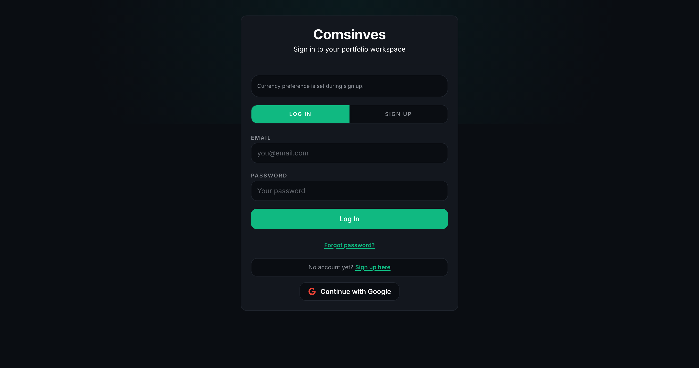
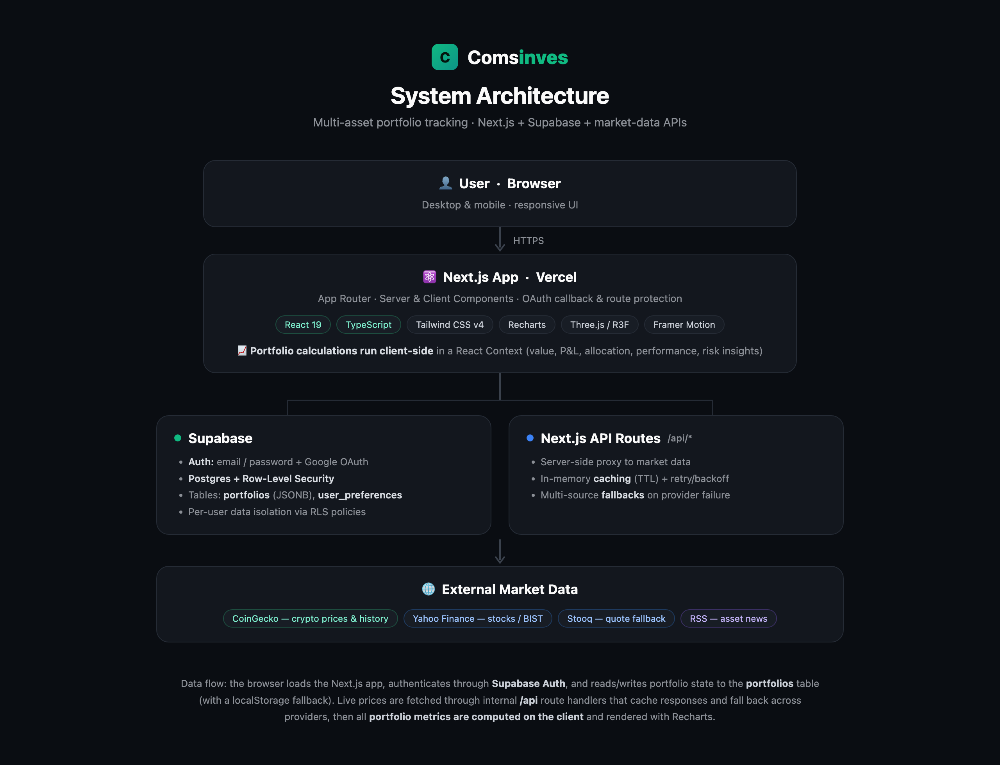

  

<h1 align="center">Comsinves</h1>

  <strong>A full-stack portfolio tracker that brings crypto, stocks, and funds into one clean dashboard.</strong>

  Track every asset in a single place — live prices, real cost-basis &amp; P&amp;L, allocation, 
  performance over time, and savings goals — across USD, TRY, and EUR.

  

  
  
  
  
  
  
  

  

---

## Overview

**Comsinves** is a fintech-style web app for tracking a personal investment portfolio across multiple asset classes — **cryptocurrencies, US stocks, Turkish (BIST) stocks, funds, and cash** — in one unified, real-time dashboard.

Instead of juggling separate exchange apps and spreadsheets, users add their holdings once and get a single view of total value, cost-basis, profit/loss, allocation, and performance over time. Each user's data is authenticated and stored per-account in the cloud, with live market prices pulled from external providers.

It's built as a real product: account sign-up and login, an onboarding flow, multi-portfolio support, multi-currency display, and a responsive UI that works on desktop and mobile.

> This repository is the public showcase for the project (documentation, architecture, and screenshots). The live application is deployed at **[comsinves.tech](https://comsinves.tech)**.

---

## Features

- **Multi-asset tracking** — crypto, US stocks, BIST stocks, funds, and cash in one portfolio, with support for custom categories.
- **Live market data** — current prices and 24h change pulled from external providers, with historical price series for charts.
- **Portfolio dashboard** — total invested, total value, asset count, recent activity, and a next-milestone progress bar at a glance.
- **Cost-basis & P&L** — per-asset and portfolio-wide unrealized and realized profit/loss, computed consistently across asset types.
- **Performance over time** — daily snapshots power portfolio-value and growth charts (30 days / 1 year).
- **Allocation & insights** — allocation by asset class plus rule-based insights: concentration risk, diversification score, top/worst performers, and volatility.
- **Transactions** — full buy/sell history with realized P&L per trade.
- **Goals & targets** — set savings milestones, log monthly contributions, and track streaks toward a target amount.
- **Multi-currency** — switch the entire portfolio between **USD**, **TRY**, and **EUR**.
- **Accounts & auth** — email/password and **Google OAuth** sign-in, with password recovery and a guided onboarding flow.
- **Bilingual UI** — English and Turkish (custom i18n layer).

---

## Screenshots

<table>
  <tr>
    <td width="50%">
<b>Dashboard</b> — portfolio overview, value chart &amp; allocation
</td>
    <td width="50%">
<b>Assets</b> — per-asset detail, price history &amp; related news
</td>
  </tr>
  <tr>
    <td width="50%">
<b>Insights</b> — allocation, momentum &amp; risk signals
</td>
    <td width="50%">
<b>Transactions</b> — buy/sell history with realized P&amp;L
</td>
  </tr>
  <tr>
    <td width="50%">
<b>Goals &amp; Targets</b> — milestones &amp; contribution streaks
</td>
    <td width="50%">
<b>Authentication</b> — email/password &amp; Google OAuth
</td>
  </tr>
</table>

---

## Tech Stack

| Layer | Technology |
|---|---|
| **Framework** | Next.js 16 (App Router), React 19, TypeScript |
| **Styling** | Tailwind CSS v4, custom design system, Lucide icons |
| **Data viz** | Recharts (portfolio, allocation & price charts) |
| **Landing visuals** | Three.js / React Three Fiber, Framer Motion, GSAP |
| **Auth & database** | Supabase (PostgreSQL + Auth, Row-Level Security) |
| **Market data** | CoinGecko (crypto), Yahoo Finance & Stooq (stocks/BIST), RSS (news) |
| **State** | React Context (client-side portfolio calculations) |
| **Hosting & analytics** | Vercel + Vercel Analytics / Speed Insights |

---

## Architecture

  

At a high level:

1. The **browser** loads the Next.js app and authenticates through **Supabase Auth** (email/password or Google OAuth).
2. Per-user **portfolio data** is read from and written to a Supabase **Postgres** table protected by Row-Level Security, with a **localStorage fallback** for resilience.
3. Live **market prices** are fetched through internal **Next.js API route handlers** that act as a caching, rate-limit-aware proxy over external providers — falling back across CoinGecko → Yahoo Finance → Stooq when a source fails.
4. All **portfolio metrics** (value, cost-basis, P&L, allocation, performance, risk insights) are computed **client-side** in a single React Context and rendered with Recharts.

A deeper breakdown lives in **[docs/ARCHITECTURE.md](docs/ARCHITECTURE.md)**.

---

## Engineering Decisions

- **Client-side calculations in one React Context** — a single source of truth keeps the UI instantly reactive when assets, prices, or transactions change, without server round-trips to recompute.
- **Internal API routes as a market-data proxy** — instead of calling providers from the browser, requests go through `/api/*` handlers that add in-memory caching (with TTLs), exponential backoff on rate limits, and multi-provider fallbacks. This isolates provider quirks and keeps the client simple.
- **JSONB portfolio payload + RLS** — storing the portfolio as a flexible JSONB document avoids brittle migrations as the data model evolves, while Row-Level Security guarantees each user can only ever touch their own row.
- **Dual persistence with a safe merge** — cloud storage with a localStorage fallback means the app still works offline/guest, and a merge guard prevents an empty load from overwriting good data.
- **Custom Tailwind design system** — no heavy component library; a small set of reusable primitives keeps the bundle lean and the dark "glass" aesthetic consistent.

---

## Challenges Solved

- **Unreliable free market APIs & rate limits** — handled with caching, retry/backoff on `429`s, and a chain of fallback providers so the dashboard stays populated even when an upstream source fails.
- **Consistent math across mixed asset types** — crypto, US/BIST stocks, funds, and cash all flow through one unified valuation and P&L model, with multi-currency conversion for display.
- **OAuth redirects with Supabase** — a dedicated `/auth/callback` route exchanges the OAuth code for a session and routes new users into onboarding.
- **Historical performance without a time-series DB** — daily portfolio snapshots are persisted and used to chart value and growth over time.

---

## Future Improvements

- Live FX rates for currency conversion (currently uses static rates).
- Move heavier calculations and snapshotting server-side for larger portfolios.
- Automated test suite and CI pipeline.
- Broader asset coverage and additional data-provider redundancy.
- Installable PWA / further mobile polish.

---

## Documentation

- **[Architecture](docs/ARCHITECTURE.md)** — frontend structure, data & auth flow, external APIs, data lifecycle.
- **[Development](docs/DEVELOPMENT.md)** — local setup, environment variables, running, and deployment notes.

---

## About

Comsinves was built to explore real-world full-stack engineering in fintech: authentication and per-user data isolation, integrating unreliable third-party market APIs, and designing a clean, data-dense dashboard. It is an actively developed personal project.

  Built by <a href="https://github.com/goktugksoyturk">Göktuğ Kaan</a> · Live at <a href="https://comsinves.tech">comsinves.tech</a>

